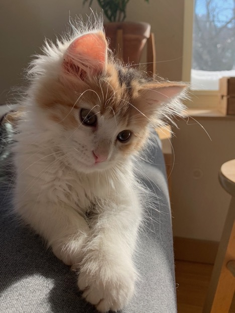

```{r setup, include=FALSE}
knitr::opts_chunk$set(echo = TRUE)
```

I am originally from New Bethlehem, Pennsylvania. I grew up on a farm surrounded by woods, and I think being so close to nature influenced my decision to pursue environmental engineering. I wrote my college admission essay about walking through the woods during a fall rain - my favorite weather - and I've carried my love for nature throughout my career path.

 

$$\\[0.25in]$$

## My Pets

 

 

$$\\[0.1in]$$


I am the proud co-parent of two cats, Ginza and Valentina.

$$\\[4in]$$

## Hobbies

At the beginning of the pandemic, some friends re-introduced me to pickleball. I now play weekly with my friends, and last December my friend and research group-mate Shion and I took second place in a local tournament! I also enjoy reading and playing video games (though I make very slow progress during the semester).

 