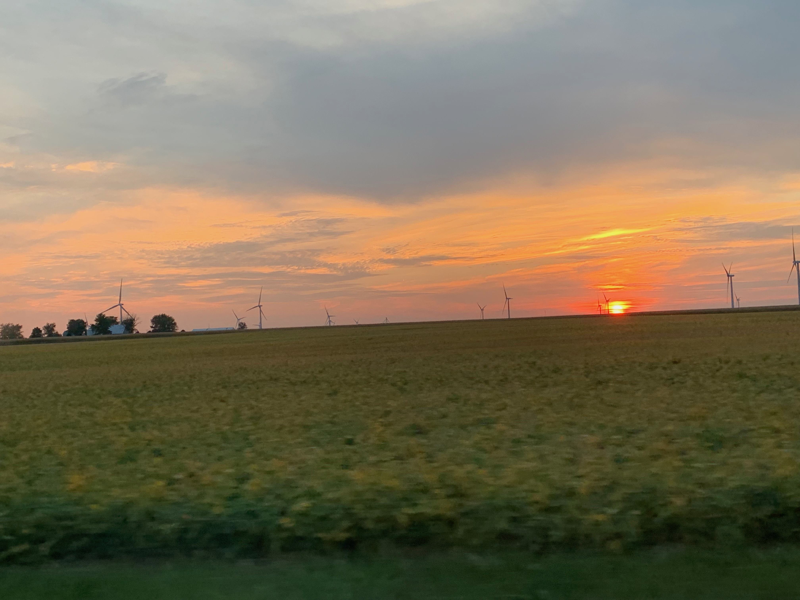

```{r setup, include=FALSE}
knitr::opts_chunk$set(echo = TRUE)
```

 

$$\\[0.15in]$$


## Education
    
* Ph.D. Environmental Engineering, University of Illinois Urbana-Champaign, 2025 (anticipated)
* M.S. Environmental Engineering, University of Illinois Urbana-Champaign, 2021
    + Energy and Sustainability Engineering Certificate
* B.S. Environmental Engineering, Bucknell University, 2019
    + Semester Abroad Spring 2018, Temple University Japan Campus
  
[Curriculum Vitae](files/DWStewart_CV_06.2022.pdf) (Current as of June 2022)
  
$$\\[0.2in]$$

## Welcome to My Website!

I am currently a Ph.D. student in [Dr. Jeremy Guest](https://cee.illinois.edu/directory/profile/jsguest)'s [research group](https://engineeringforsustainability.com/) at the University of Illinois Urbana-Champaign ([UIUC](https://cee.illinois.edu/)). I also did my Master's degree with Dr. Guest at UIUC. My research is supported by the Department of Energy Center for Advanced Bioenergy and Bioproducts Innovation ([CABBI](https://cabbi.bio/)). I received my Bachelor's degree from [Bucknell University](https://www.bucknell.edu/academics/college-engineering/majors-departments/civil-environmental-engineering), and am a registered Engineer in Training (E.I.T.) in the state of Pennsylvania. My contact information can be found at the top right of the navigation bar, feel free to reach out!

$$\\[0.2in]$$

## What am I working on right now?

Right now I'm in the midst of finishing up my first first-author manuscript where I explore the influence of a biorefinery's location on its financial viability. This summer, I am also very fortunate to be participating in the [Policy and Research Legislative Fellowship](https://csbs.research.illinois.edu/research-engagement/policy-and-research-legislative-fellowship/) program at UIUC. I'm working on a research project with the Office of [Illinois State Senator Scott Bennett](https://www.ilga.gov/senate/Senator.asp?MemberID=2887) to determine if the [Climate and Equitable Jobs Act](https://www2.illinois.gov/epa/topics/ceja/Pages/default.aspx) is affecting electricity prices in Illinois. Take a look at my [Research](research.html) tab to learn more!

 