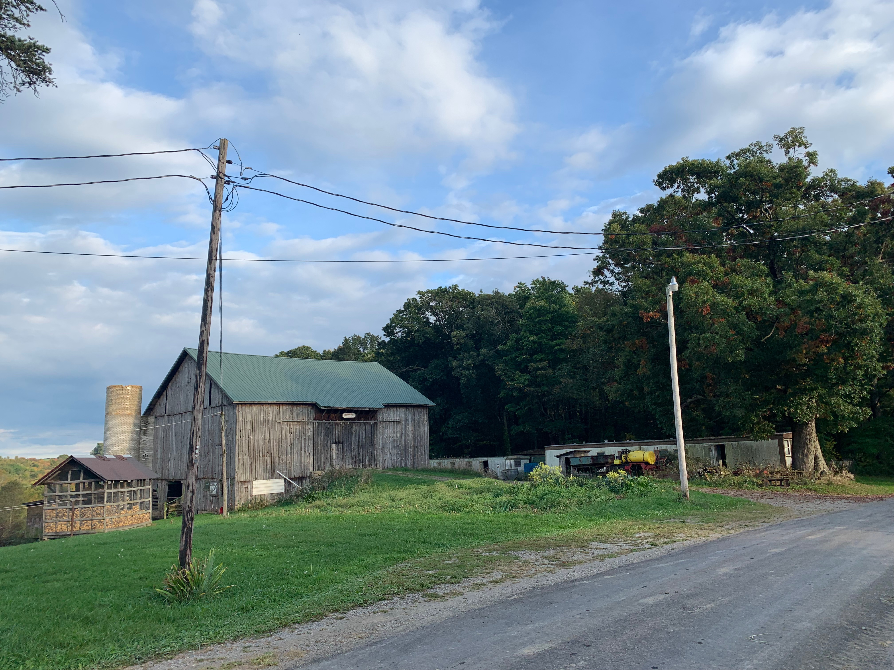

```{r setup, include=FALSE}
knitr::opts_chunk$set(echo = TRUE)
```

This page takes some inspiration from my [advisor's website](https://engineeringforsustainability.com/postcards/), where he posts pictures of postcards from locations group members have visited. I enjoy photography, so I'm going to use this page to share landscape photos from locations where I've worked and studied.

$$\\[0.25in]$$

 
*The landscape surrounding me while in graduate school in Champaign, Illinois. (photo taken in 2021)*

$$\\[0.25in]$$

 
*A landscape from my study abroad in Tokyo, Japan. This is Chiyoda Ward (where the Imperial Palace is located) during hanami (cherry blossom viewing) season. (photo taken in 2018)*

$$\\[0.25in]$$

*I know I have landscapes featuring the Bucknell sunset somewhere...*

$$\\[0.25in]$$

 
*My first landscape: my family farm in New Bethlehem, Pennsylvania. (photo taken in 2021)*

$$\\[0.2in]$$